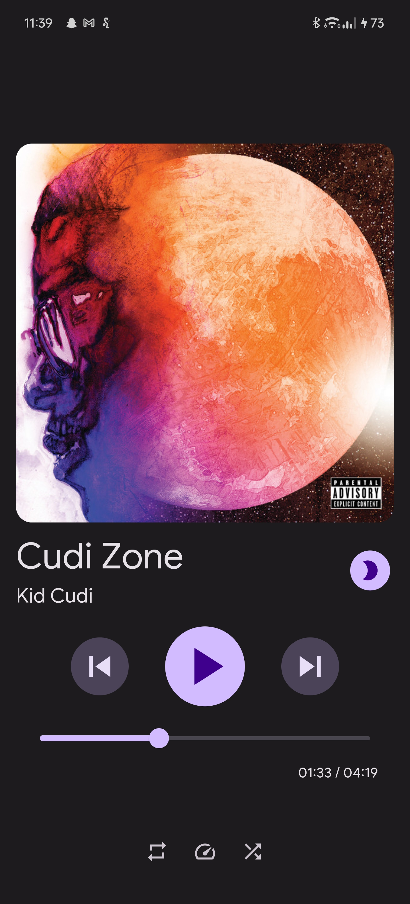

# Moosic 🎶 🚧

Moosic is a simple music player app built with Flutter. It allows users to play audio files stored on their device with
basic playback controls and a user-friendly interface.

***VERY LIMITED FUNCTIONALITY*** 

## Features

* Play audio files stored on your device.
* Pause, resume, and skip tracks.
* View track duration and seek through tracks with a slider.
* Display album artwork and track information (title, artist).

## Work In Progress
* Proper playing notification
* Playlists and queue support
* General UI improvements
* Custom folder selection (right now defaults to /sdcard/Music)
* Lots of other things

## Getting Started

To get started with Moosic, follow these steps:

Clone the repository:
`
git clone https://github.com/your-username/moosic.git`

Navigate to the project directory:
`
cd moosic`

When the app launches, it will display a list of audio files in `/sdcard/Music`.
Tap on a track to start playback.
Use the playback controls (play, pause, skip) at the bottom of the screen to control playback.
Drag the slider to seek through the track.
Enjoy listening to your favorite music with Moosic!

## Screenshots

## Contributing

Contributions to Moosic are welcome! If you find any bugs or have suggestions for improvements, please open an issue or
submit a pull request.

## License

This project is licensed under the MIT License.